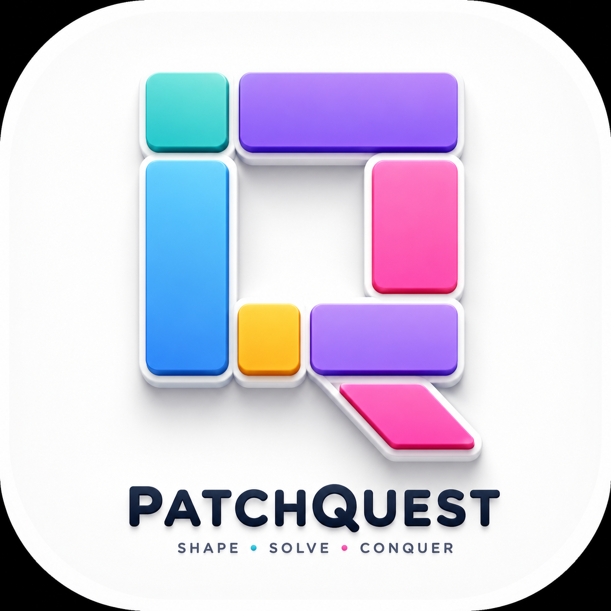

# PatchQuest

	

PatchQuest is a Flutter puzzle game built around uncovering and placing patches on the board. The app ships with mobile, desktop, and web targets enabled from the same codebase.

## Getting Started

To run the app locally:

1. Install Flutter and make sure the SDK is available in your shell.
2. Fetch dependencies with `flutter pub get`.
3. Launch the app with `flutter run`.

## Project Structure

- `lib/` contains the main game UI and gameplay logic.
- `assets/` contains the PatchQuest logos and app icon.
- `android/`, `ios/`, `web/`, `windows/`, `macos/`, and `linux/` contain the platform runners.

## Resources

- [Flutter documentation](https://docs.flutter.dev/)
- [Flutter codelab](https://docs.flutter.dev/get-started/codelab)
- [Flutter learning resources](https://docs.flutter.dev/reference/learning-resources)
